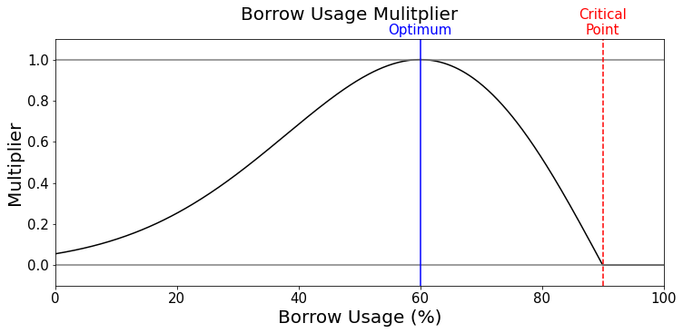

# ARCx Credit Introduction

### What is ARCx Credit?

[ARCx Credit](https://arcx.money) is a decentralized credit market on the Polygon network that offers dynamic maximum-LTV loans on ETH collateral based on a borrower’s DeFi Credit Score. The [DeFi Credit Score](application/defi-credit-score/) provides a credit risk assessment for individual wallet addresses based on historical on-chain borrowing activity. Through these systems, borrowers who use ARCx Credit will build their DeFi Credit Score and progressively unlock greater capital efficiency on their crypto-collateralized loans. Our ultimate aim is to build an accurate and efficient reputation-based credit market in DeFi.

### Why does ARCx Credit exist?&#x20;

A lender’s effective and efficient evaluation of a counter-party’s credit risk, and the subsequent pricing of their overall cost of capital, is the core mechanism at the heart of global credit markets. But despite the important role that reputation plays in mature financial markets, DeFi lending has historically relied on indiscriminate mechanisms of risk management, where all borrowers are treated equally, and given the same terms regardless of the real or historical credit risk they represent. The lack of an identity and reputation layer in the DeFi stack has forced the first generation of crypto credit markets to depend on highly inefficient collateral mechanisms to ensure credit markets remain solvent. These mechanisms require substantial capital buffers due to the high volatility of collateral assets. Market participants gain no advantage over time for being a creditworthy borrower, and are subject to the same onerous collateral requirements and interest rates as those participants with a poor or inexistent track record.

Building accurate and efficient reputation-based credit markets would represent a step-change innovation for the DeFi lending industry, unlocking immense efficiencies. It would offer material improvements in the cost of capital for the majority of borrowers who demonstrate effective risk management behaviors. It would allow the most sound and creditworthy borrowers to increase their capital efficiency over and above that of other participants, providing a significant competitive advantage. It would allow lenders to supply liquidity preferentially based on the credit risk of individual borrowers, leading to the formation of a credit spread between different risk profiles. The development of an effective reputation layer supporting DeFi credit represents the next major frontier for crypto finance.

### How does ARCx Credit work?

1. We use the [DeFi Credit Score](application/defi-credit-score/) to provide a credit risk assessment for individual wallet addresses based on historical on-chain borrowing activity. Scores for each address are calculated and then published on-chain via a gas efficient and [secure oracle infrastructure](risk-and-infrastructure/infrastructure/). &#x20;
2. We then offer personalized maximum loan-to-value (LTV) ratios to borrowers based on their [DeFi Credit Score](application/defi-credit-score/). Borrowers with higher scores will be able to access more debt with the same collateral level and LTV ratio. Scores are fetched from our [API](https://docs.arcx.money), and are then verified on-chain via our oracle infrastructure. &#x20;
3. We continuously monitor system health and manage a number of unique [control parameters](risk-and-infrastructure/risk-management/design-considerations.md) that allow us to refine our risk exposure and profit model over time. We share reports and analysis on our [Community Discord Server](https://discord.gg/arcx).

### How do I build my DeFi Credit Score?

You can build your DeFi Credit Score by borrowing on [ARCx Credit](https://arcx.money) vaults while avoiding excessive risk exposure or liquidations; or by borrowing on a selection of third party borrowing platforms and avoiding liquidations relative to the rest of the market.&#x20;

This is enforced through three separate rules, which are calculated separately and then combined to derive the final Score.&#x20;

1. [Daily Score Reward](application/defi-credit-score/daily-score-reward.md): Evaluates your borrow usage (i.e. current LTV as a percentage of max LTV) on ARCx Credit vaults over the prior 120 days relative to a “responsible” borrower archetype and rewards points according to a “Rewards Curve” on a daily basis. Currently, the number of points earned each day peaks when a position is held at 60% borrow usage, and tapers off toward the lower (more conservative) or higher (more aggressive) ranges of the risk curve (\*)
2. [Survival Score Reward](application/defi-credit-score/survival-score-reward.md) Evaluates your ability to avoid liquidations on any indexed third-party platform relative to the rest of the market, rewarding or subtracting points proportional to the “liquidation density” on a given day. Unlike the Daily Score Reward, which looks only at the previous 120 days of borrowing experience on ARCx Credit, the Survival Score Reward considers the borrowing experience of a wallet address over its entire lifetime outside of ARCx Credit. Currently, the maximum number of points a borrower can earn from the Survival Score Reward is 300.
3. [Liquidation Penalty](application/defi-credit-score/liquidation-penalty.md): Subtracts a fixed number of points for every day in which a liquidation occurs. The penalty only applies for 120 days, similar to the Daily Score Reward. After this period, the penalty is removed from the Borrower’s score..&#x20;

\* Note, as our system evolves, borrowers who have built trust with ARCx Credit will be able to maintain their high Scores while borrowing at their desired risk levels. By initially aligning the growth of the Credit Score with borrow usage, we aim to [discourage excessive risk exposure](./#how-do-we-incentivize-responsible-borrowing), and by extension, [mitigate the risk](./#how-are-risks-managed) to the protocol and to lenders.

### How does my credit score relate to borrow usage?

The speed at which the [Daily Score Reward](application/defi-credit-score/daily-score-reward.md) component of your DeFi Credit Score grows is directly related to Borrow Usage across your active positions on ARCx. Borrow Usage represents your current LTV as a percentage of max LTV, which is determined by the amount of collateral you have deposited and the maximum LTV you are offered by virtue of your DeFi Credit Score.

### Can my DeFi Credit Score go down?

Your DeFi Credit Score may lose points in two ways.

* Firstly, your score will eventually trend downward if your Daily Score Reward growth is slower than the rate at which those points are expiring (i.e. 120 days prior). This will happen if you stop borrowing entirely (and your borrow usage is 0%), if you borrow in excess of the “critical point” (i.e. your borrow usage is greater than 90%), or if you are simply borrowing at a less optimal borrow usage relative to what you were borrowing at 120 days prior.&#x20;
* Secondly, your score will diminish if any of your active positions are liquidated. Currently, a penalty of -250 points per liquidation per day is imposed. After 120 days, the penalty is removed and the liquidation event is no longer considered.

### What is the “optimal” borrow usage to grow my credit score?


The current optimal borrow usage to grow your DeFi Credit Score is 60%


The shape of the Rewards Curve, including the optimal borrow usage and the amount of drop-off left or right of the optimal point, are parameters set by the Risk function. In our current iteration, the choice of 60% was based on an analysis of experienced stablecoin borrowers on Compound Finance who use ETH as collateral (i.e. it represents a position that balances efficiency with risk exposure given the volatility of ETH)

In this analysis, we found those holding over $1K in debt tend to manage between 50% and 60% of their maximum loan-to-value (LTV). This was further explained through user research, where we found that experienced borrowers with larger loans viewed this range as representing a balanced “safety buffer” for their collateral.

.png>)

For more information, see [Daily Score Reward](application/defi-credit-score/daily-score-reward.md).

### Which third-party borrowing platforms are currently indexed?

In addition to using borrowing activity from ARCx to construct the DeFi Credit Score, we also index data from third-party platforms (e.g. Aave and Compound). For a list of third-party borrowing platforms currently indexed, see [Data Sources](application/defi-credit-score/data-sources.md).

The process of indexing a third-party platform takes time, but we are constantly adding more. If you would like us to start indexing a particular platform or protocol, please let us know by joining our [Discord](http://discord.gg/arcx) and speaking with our team.

### How do I borrow on ARCx Credit?


Note, ARCx Credit is currently in Closed Beta. To join the waitlist, please visit [https://arcx.money](https://arcx.money) and fill out the waitlist form.&#x20;


In order to interact with ARCx Credit, you will first need to deposit collateral into one of our vaults (e.g. WETH-A). After depositing, you will be allowed to borrow up to your maximum loan-to-value (LTV) ratio. In order to maximize the speed at which your DeFi Credit Score grows, you can choose to borrow at the “optimal” Borrow Usage level. Once a borrow position is active, you can then view and manage your position over time, including depositing, borrowing, repaying, or withdrawing. Finally, since your DeFi Credit Score grows over time, you can revisit the app to see how your improved Score corresponds to a higher maximum LTV.

### How do I unlock better capital efficiency?

A user who grows their DeFi Credit Score through responsible borrowing will unlock greater capital efficiency from their collateralized crypto assets within ARCx vaults. This is primarily achieved by mapping the DeFi Credit Score (a value between 0 and 999) with a range of maximum LTV ratios for each vault.

To support this, we have implemented a three-tiered vault design, with each collateral asset having three distinct vault options distinguished by the range of max LTVs offered (”capital efficiency”), the minimum Score required to access the vault (”score threshold”), and the maximum amount of debt a borrower can access (”credit limit”).

* **Capital efficiency** describes the range of max LTV ratios that the vault offers depending on the user’s DeFi Credit Score. For example, a borrower with a score of 0 will have their position in the WETH-A vault liquidated at a max-LTV of 80%, while a borrower with a score of 999 will be liquidated in the same vault at a max-LTV of 90%. Because the DeFi Credit Score changes daily, so too will a borrower’s maximum LTV offered across different vaults. Additionally, while the “optimal” borrow usage for growing the DeFi Credit Score stays constant across vaults, the specific LTV that this borrow usage represents increases in higher tiered vaults.
* **Score thresholds** prevent access to higher-tiered (i.e. more capital efficient) vaults until the borrower achieves the minimum DeFi Credit Score required. By default, everyone has access to the “A” vault, as it has a score threshold of 0. Vaults “B” and “C” offer comparatively higher maximum LTV ratios, and are gated to lower risk borrowers who achieve Credit Scores above the thresholds set. Should a borrower’s Score fall below the threshold, they will be unable to borrow more until their score returns to the required level.
* **Credit limits** create a ceiling to the amount of debt that an individual can borrow from a specific vault. Rather than allowing a user to borrow an unlimited amount, the credit limit provides a way to limit the quantum of losses born through unprofitable liquidations, particularly for higher tiered vaults. To more explicitly tie borrower behavior with the amount of debt we feel comfortable extending, credit limits for an individual vault can be determined dynamically based on the amount a user has borrowed in other vaults.

The three-tiered vault design was selected to balance the user experience requirement of progressively and frictionlessly unlocking greater capital efficiency while borrowing, with the financial and risk requirement of minimizing losses through unprofitable liquidations. The design provides ARCx Credit with the ability to fine-tune a variety of risk controls at the individual vault-level (such as max-LTV ranges, score thresholds, and credit limits), helping to maximize net profit across our loan book. Additionally, since Lenders are able to supply funds to Borrowers with specific Score ranges (e.g. over 500 only), we create the conditions necessary for the market to determine a true credit spread between different Borrowers based on the DeFi Credit Score.&#x20;

For more information, see [profit model](risk-and-infrastructure/risk-management/) and [vault design and credit limits](application/borrowing/vault-design.md).

### What costs are associated with borrowing on ARCx Credit?

ARCx Credit charges borrowers an interest rate on outstanding loans, a borrow initiation fee, and a penalty for liquidations.&#x20;

For more information, see [fee structure](application/borrowing/fee-structure.md).&#x20;

### How frequently is my DeFi Credit Score updated?

The DeFi Credit Score is updated on-chain via our merkle root oracle infrastructure every Epoch (currently set at 24 hours). But before Scores become active on the blockchain, they must first spend 1 epoch on the _SapphirePassportScores_ contract as the “upcoming Merkle root”. This step of having a public “upcoming root” provides an additional layer of security and transparency, allowing for anyone to externally validate both the “current root” and the “upcoming root”. When a new root is thus published, the “upcoming root” becomes the “current root”, and the new root takes its turn as the “upcoming root”. This delay will be shortened over time.&#x20;

For more information, see [infrastructure](risk-and-infrastructure/infrastructure/).

### How are risks managed?

The ARCx Credit protocol has been designed to avoid excessive exposure to any single party, and to rely on empirical data and rational incentives instead of trust.

* The DeFi Credit Score is based on real statistical indicators of credit risk, and contains no subjective analysis of a debtor’s profile based on their identity. Trusting a brand name fund, trading desk or other market participant has proven to be extremely hazardous, subject to significant tail risks and the possibility of fraud. We believe that trusting on-chain data levels the playing field for market participants and will prove itself as a more reliable indicator for credit risk.
* The rules of the DeFi Credit Score are transparent and easy to understand. Instead of building a “black box” machine learning model that ingests hundreds of data points to return a result, we enable lenders to do their own research to understand the counter-party risk of our users. Through explaining the rules clearly to both parties and publishing updated scores on-chain each day, we are providing the tools for lenders to evaluate the performance of our risk modeling more than other credit scores are willing or able to do. Ultimately the market determines the probative value of our scoring, and will price their liquidity accordingly.
* ARCx Credit and DeFi Credit Score system health KPIs are monitored and publicly available to track for lenders, borrowers and investors alike. As discussed below, we control a number of parameters that influence how much risk we introduce into the system. Making this data and the process by which different parameters are updated more transparent is critical to building trust with market participants.
* The three-tiered vault design and the addition of a dynamic credit limit based on previous borrowing actively prevent exploitation and debt concentration risk for the protocol. If a user deposits $1 worth of ETH, and borrows perfectly until they have a Score of 999, they will not then be able to borrow a large sum of money in Vault C.

Besides this, ARCx Credit is also exposed to smart contract risk (i.e. the risk that a bug within the protocol code can be exploited). ARCx Credit is a new protocol that has been in development for over 12 months. Our contracts are scheduled to be audited by Trail of Bits in October 2022.

### How do we manage profitability?

Protocol net profit is equal to the sum of fees generated by Borrowers (through interest, borrow fees and liquidations) minus the losses they incur to the protocol (through unprofitable liquidations). Borrowers in the highest tiered vaults pose the greatest risk to profitability, since liquidations there may lead to the accumulation of toxic debt in the system (i.e. debt which is not recoverable by liquidating the underlying collateral).

To manage and optimize profitability, the ARCx Credit system provides a number of unique control parameters. Through understanding, monitoring and fine-tuning these parameters, ARCx Credit will deliver sustainable net profit across its loan book.

| Control parameter                                                                   | Description                                                                                                                                                                                                                                                                                                                                                                                                |
| ----------------------------------------------------------------------------------- | ---------------------------------------------------------------------------------------------------------------------------------------------------------------------------------------------------------------------------------------------------------------------------------------------------------------------------------------------------------------------------------------------------------- |
| Maximum LTV offered in each vault                                                   | The primary way in which [ARCx Credit](https://arcx.money) exposes itself and its lenders to risk of unprofitable liquidations. Based on our analysis, we are comfortable launching with 100% max-LTV on ETH collateral for borrowers with a DeFi Credit Score of 999.                                                                                                                                     |
| Fees charged to borrowers                                                           | The [fees](application/borrowing/fee-structure.md) we generate through interest rates, loan instantiations and liquidations. Fees are earned from borrowers as they build their DeFi Credit Score, and may be used to cover losses born from unprofitable liquidations. At present, the interest rate is set by ARCx Credit, but in future this will be set dynamically based on supply / demand.          |
| Score impact for borrowing (or the time required to improve your DeFi Credit Score) | The length of time required for a borrower to build their DeFi Credit Score will influence the amount of fees we generate from an individual borrower before a liquidation might result in the accumulation of toxic debt                                                                                                                                                                                  |
| Score impact for liquidations                                                       | The impact on a borrower’s DeFi Credit Score in the event of a liquidation. The impact should be configured such that it appropriately disincentivize liquidations, primarily by the opportunity cost of losing access to improved capital efficiency and the time required to rebuild the Score.                                                                                                          |
| Shape and configuration of the Rewards Curve                                        | The shape and configuration of the Rewards Curve that determines the Daily Score Reward. This includes defining the "optimal" borrow usage point (influencing where borrowers sit to grow their Scores), and the shape of the curve itself (e.g. providing more flexibility to borrowers in determining their own optimal positions without unnecessarily penalizing them with a lower Daily Score Reward) |
| Credit limit imposed on each vault                                                  | The maximum amount of debt a borrower can access from a given vault, regardless of their collateral deposited. This prevents debt concentration risk in higher tiered vaults, and limits the quantum of losses on liquidation. Credit limits may be static (i.e. the same for all borrowers) or dynamic (i.e. based on how much debt a borrower has used in other vaults).                                 |

### How do we incentivize responsible borrowing?

The design of [ARCx Credit](https://arcx.money) and the DeFi Credit Score aim to incentivize responsible borrowing behavior. This is based on two unique factors:

1. The time and effort required to build to a high DeFi Credit Score (which would be a sunk cost if a wallet is abandoned after liquidation)
2. The quantifiable benefit that a borrower receives from continued access to higher-tiered vaults (i.e. the capital efficiency gained)

Since the growth of the DeFi Credit Score is explicitly tied to responsible borrowing behavior, users who want access to improved capital efficiency will be incentivized to borrow responsibly. Conversely, if the expected benefits of continued access to improved capital efficiency exceed the penalty for liquidation and the time and effort required to rebuild a Score, then borrowers will be incentivized to avoid liquidation.

### How do I join the Closed Beta?

To ensure the system works as expected and to allow us time to refine our risk parameters, we have created a waitlist which you can [join now](https://arcx.money). We will be whitelisting addresses each week before a wider release following our audit with Trail of Bits in mid-October 2022.

To get started:

1. Visit [https://arcx.money](https://arcx.money)
2. Add your email address and click “join waitlist”
3. Fill in our optional research survey (this just helps us improve our product)
4. We’ll send you an email when your address is whitelisted

### Is there a token for ARCx?

Yes. The [ARCx Governance Token](https://www.coingecko.com/en/coins/arc-governance) is the primary governance mechanism for the ARCx protocol. The token is used to vote and decide on the outcome of ARCx Improvement Proposals (AIPs).&#x20;

There is a ETH-paired liquidity pool on Uniswap (on Ethereum), which can be [accessed here](https://app.uniswap.org/#/swap?inputCurrency=0x1321f1f1aa541a56c31682c57b80ecfccd9bb288\&outputCurrency=ETH\&chain=mainnet).&#x20;

For more information, see [ARCX Token](protocol/arcx-token.md).

### Who is behind ARCx?

We are a team of product builders who believe that on-chain reputation will transform decentralized economies for the better. Come join us on [Discord](https://discord.gg/arcx) to learn more.

***
