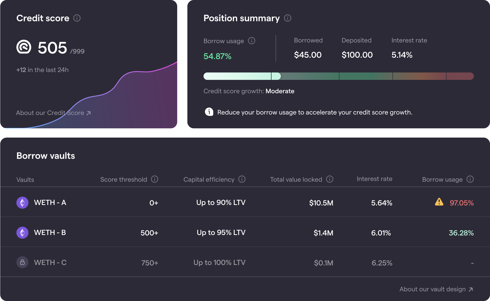

# Daily Score Reward

### Introduction

The Daily Score Reward evaluates borrow usage over the past 120 days relative to an “optimal” borrower archetype and rewards points according to a “Rewards Curve” on a daily basis. The Daily Score Reward aims to simplify the game of building your Credit Score down to a simple rule - “Stay in the Green”. By simply maintaining a borrow usage within the “optimal” green zone, it is possible to reach a score of 999 within 120 days.

The design of the Daily Score Reward aims to satisfy the following outcomes:

* Users who borrow too close to their limit (borrow usage close to 100%) are risky and should not given a high score.
* Users who borrow only a small fraction of their capacity (low borrow usage) are not borrowing efficiently and should not be rewarded with a high score.
* Users who borrow efficiently, but maintain appropriate risk levels are the ideal borrowers. These users should maximize their score.

To explain this further, let’s break down the Daily Score Reward.

### **"Borrow usage"**

Borrow usage refers to the amount borrowed relative to the available credit. Borrow usage is a percentage value, where 100% triggers a liquidation event. Available credit is determined by the amount of collateral you have deposited and the maximum LTV you are offered, which is based on your credit score.

Borrow usage is shown prominently in the application. Firstly, the Position Summary card shows aggregate borrow usage across all active vaults. Secondly, the Borrow Vaults table shows borrow usage for each individual active vault.

### **"Optimal borrower"**


ARCx defines the “optimal borrower” as someone who maintains 60% borrow usage across their active positions.


A borrow usage of 60% was selected based on a “community consensus” of borrowers on Compound Finance who borrowed stablecoin debt against Ethereum collateral. In the future, we plan to make this optimal value a dynamic variable based on the real-world actions of borrowers with the highest credit scores.

ARCx asserts that a borrow usage of 60% reflects someone who borrows efficiently, but maintains appropriate risk levels. To implement this assertion we reward points to users based on a defined “Rewards Curve”.

### **"Rewards Curve"**


The Rewards Curve determines the number of points allocated at different borrow usage levels


The Daily Score Reward is calculated by mapping the borrow usage to a score impact. The mapping is performed using the “Rewards Curve” shown below

The Rewards Curve is defined using the following base equation:

$$
kxe^{-kx^2}
$$

Specifically, the equation for the shape of the curve is:

$$
F=\left\{\begin{array}{ll}      \frac{\beta-x}{\beta- P}e^{-\frac{1}{2}(\frac{\beta-x}{\beta-P})^{2}+\frac{1}{2}}  & x\le\beta \\   
\\   0 & x>\beta \\\end{array} \right.
$$

Where

* $$x$$ is the borrow usage value (0-1)
* $$\beta$$ is the borrow usage value at which the multiplier becomes zero (90% in the above), this is the “Critical Point”.
* $$P$$ is the borrow usage value of the peak (60% in the above), called the “Optimum Point”.

This relation is clipped at 0 for borrow usage values above $$\beta$$. This means that a user with a position above this value will not gain daily improvements to their credit score.

The relationship between borrow usage and Credit Score growth is surfaced prominently in the application itself.

On the Position Summary card, borrowers can see their borrow usage and how quickly their credit score is expected to grow. A personalized suggestion below the borrow usage bar will display a message guiding the borrower to optimize their position to maximize the growth of their credit score. To action this suggestion, the borrower would need to adjust their debt (either repay or borrow), or their collateral (either deposit or withdraw). On the Credit Score card, borrowers can see their current Credit Score, and the daily score impact over the past 24 hours. A line chart behind the Credit Score card shows how a borrower’s Score has changed over time.

To illustrate the connection between Borrow Usage and the growth of your DeFi Credit Score, the borrow usage bar is broken into 5 segments that denote how their borrowing position will impact the growth of their Credit Score. The segments and their proportions are as follows: “Not growing” (0%), “Slow” (>0% - 25%), “Moderate” (25% - 50%), “Optimal” (50% - 70%), “Slow” (70% - 90%), and “Not growing” (90% - 100%).

### **"Past 120 days"**


Only borrow usage values within the last 120 days are considered when calculating the Daily Score Reward component


The Daily Score Reward only consider borrowing behavior within the last 120 days. This means a Borrower has to continually borrow or their score will go down over time. However, the Daily Score Reward is designed to allow good Borrowers who maintain the optimal borrow usage to reach the top score of 999 within 120 days, even if they start with a score of 0.

The selection of 120 days is based on the following considerations:

* The mark of a reliable Borrower is how well they manage debt through tough market conditions. Historically, the price of Ethereum has never made it more than approximately 2 months without undergoing a crash of more than 10%. As such, we want to ensure that all borrowers who have reached the top score have experienced at least some market volatility in order to gauge how well they borrow.
* We aim for a compromise between building an engaging Credit Score that the user can grow in a reasonable amount of time, and a score which is not too volatile so a borrower can expect their Score not to change too much day to day.

With these considerations, we find a 120 day window to be appropriate. We define the Score such that the optimum borrower reaches a score of 999 exactly within the window (from a starting Score of 0), and so the optimal daily impact is $$999/120=8.325$$ points per day.

### **"Hourly basis"**


The daily score reward is calculated by assessing borrow usage at the end of each hour, and it is updated on-chain daily.


Hourly granularity was chosen because it allows us to measure the borrowers behavior across a day. We award points to the credit score every hour and sum those points over each day to calculate the daily impact.
