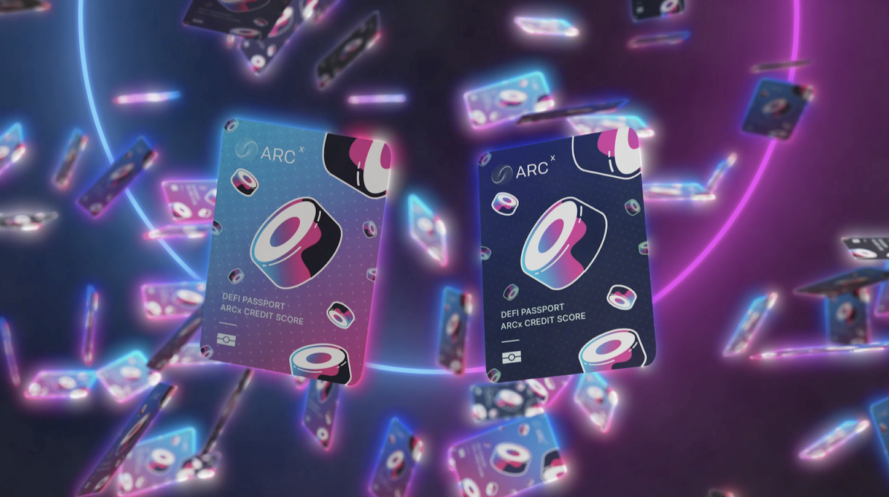

# Passport Skins

DeFi Passport Skins are custom NFT skins you can use to customise the look and feel of your DeFi Passport, providing you with the ability to personalise your passport by selecting from a range of styles and designs.

You can use these skins to express what you value by showing support for a favourite project or to express a specific visual aesthetic that resonates with what you’re about.

Once you get a DeFi passport skin it will be available to select as your default skin which is displayed in the ARCx application and on your actual DeFi Passport NFT when it goes live. \
\
The first set of skins were auctioned off with designs featuring Sushi, Olympus and AAVE. \
Further details can be found in our [substack article.](https://arcx.substack.com/p/introducing-defi-passport-skins)
